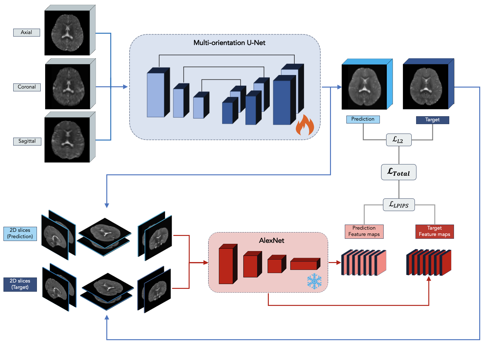

# Multi-orientation U-Net

Official PyTorch implementation of Multi-orientation U-Net (MO U-Net). 



### Prerequisites

See `requirements.txt`

```
pip install -r requirements.txt
```

### Preprocessing

Before training the model, set data_dir in "Base_options.py" and run "run preproc.py" to convert data into h5 file format (required format for the dataloader). Files should be arranged in the following format prior to running the preprocessing script:

	├── Data_folder                   
	|   ├── Subject_1               
	|   |   ├── Axial.nii 
    |   |   ├── Coronal.nii 
    |   |   ├── Sagittal.nii
	|   |   └── High_field.nii                   
	|   ├── Subject_2                       
	|   |   ├── Axial.nii 
    |   |   ├── Coronal.nii 
    |   |   ├── Sagittal.nii
	|   |   └── High_field.nii  

### Training

Modify "BaseOptions.py" to set directory for preprocessed data and training configurations.

### Prediction

Modify "TestOptions.py" file to specify input image, output directory, and prefix specifying subject number. 
Run "test.py" to obtain prediction (saved as 'sub<x>pred_final.nii')

### Pre-trained model

Download our trained Multi-orientation U-Net from the following link: 
https://emckclac-my.sharepoint.com/:u:/g/personal/k2035837_kcl_ac_uk/EQMo-cm14kJNmqGTCp0GKmwB1LfXJfbA0c5VOJednXFFlQ?e=mStzZZ

### Acknowledgement

Code-base adapted from:

- https://github.com/ExtremeViscent/SR-UNet

PyTorch implementation of LPIPS borrowed from:

- https://github.com/richzhang/PerceptualSimilarity

